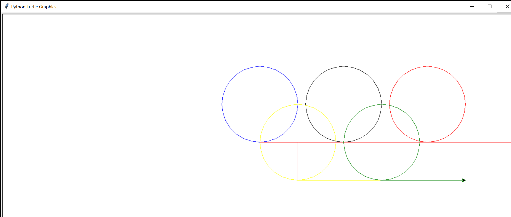

# Class 2 Review and Homework 2 

### We have covered a lot of new material today:
- Reviewed Homework 1 and how the variables and loop works
    ```python
    my_location = [100, 200, 300, 400]
    for i in my_location:
        turtle.forward(i)
    ```
    Remember, variable ```i``` takes different value each loop iteration. In the code above, variable ```i``` takes on 4 separate values ```100, 200, 300, 400``` in each loop iteration. We move the turtle forward, 4 times, distance specified in our list via variable ```i```. 


- Learned how to draw a square using our ```turtle```:
    ```python
    loc = 90 # variable assignment 
    for i in range(0,4): # 4 iteration loop
        turtle.forward(loc)
        turtle.left(loc) # Remember, 90 is the degree amount
    ```

- Explored variable types, strings vs. digits
    ```python
    my_variable_with_string = 'Ari or any name'
    my_variable_with_numbers = 100
    ```
    We can also do math with our variables:
    ```python
    (my_variable_with_numbers + 100) / 200 = 1
    ```
- Learned how to input different values, both numbers and text:

    ```python
    turtle.numinput("title","promt")
    ```
    

    Played with changing shape from square to a half-star:
    ```python
    for i in range(0,4):
        loc = turtle.numinput('Title','Input Location')
        turtle.forward(loc)
        turtle.left(loc)
    ```

- Final example allowed us to draw 4 circles, at 90 degree angles from each other, using different colors:
```python
    turtle.clearscreen()
    colors = ['red','blue','green','magenta']
    for x in range(100):
        turtle.pencolor(colors[x%4]) # index list of colors from 0-4 via remainder operator
        turtle.circle(x) # draw circle with radius of variable x
        turtle.left(90) # move left at 90 degress
```

We have learned a ```%``` modulos/remainder operator:
    *The modulus operator, sometimes also called the remainder operator or integer remainder operator works on integers (and integer expressions) and yields the remainder when the first operand is divided by the second. In Python, the modulus operator is a percent sign (%). The syntax is the same as for other operators.*

---

# Homework 2

- Please draw a triangle two ways, one way **without** a loop and another **with** a loop. Please ask for a user input to determine triangle side size. 

- Please draw olympic rings, rememberer you can set pen color using:
    ```python 
    turtle.pencolor('red') 
    ```
    *Hint: for second row of rings you need to first go back to the beginning of the drawing page, go down by half the size of your circle, using ```back```, ```right```, ```forward``` and ```left``` commands.*

    Sample output: 

---

## Please save your work in a file, you can run the saved file using command ```run yourfilename.py```

In case you want to try using professional Python development environment, please install [PyCharm community edition](https://www.jetbrains.com/pycharm/download/)


*You need to provide me your GitHub usernames so I can allow you to upload your homework files*


