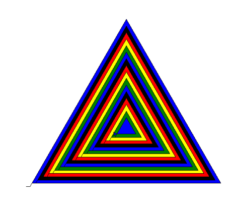

# Class 2 Review and Homework 2 

### New material covered on Thursday:

- We went over the homework and how to make rings painted in one loop:

    ```python
    import turtle

    colors = ['blue','black','red','yellow', 'green']
    turtle.pensize(10)  # change the pen size
    for loc in range(5): # five rings
        turtle.pencolor(colors[loc%5]) # way to pick sequential colors from list of colors
        turtle.pendown() # we put the pen down 
        turtle.circle(100) # draw a circle
        turtle.penup() # we bring the drawing pen up so we don't have connecting lines
        turtle.forward(220) # we move forward
    ```
    We have learned our new ```if``` statement :
    ```python
        if loc == 2:  # if it is ring number 3, remember in Python all loop counting is from 0
            turtle.back(220*3)
            turtle.forward(100)
            turtle.right(90)
            turtle.forward(100)
            turtle.left(90)
    ```

- We drew our cool triangle collage: 
    ```python
        turtle.clearscreen()
        colors = ['blue','black','red','yellow', 'green']
        loc = turtle.numinput('Title','Input Location')
        for size in range(0,16):
            turtle.forward(10)
            turtle.left(60)
            turtle.forward(10)
            turtle.right(60)
            turtle.fillcolor(colors[size % 5]) # new statement fill color
            turtle.begin_fill()  # how to fill a shape
            for i in range(0,3):
                turtle.forward(loc-size*30)  # !!! key to reducing size of the triangle
                turtle.left(120)
            turtle.end_fill()
    ```

    

- We learned the new ```if``` and ```else``` and ```elif``` statements:

    ```python
    age = turtle.numinput('Title','Input Yourage')

    if age == 11:
        turtle.write("Hello Phillip")
    elif age == 12:
        turtle.write("Hello Leo")
    else:
        turtle.write("I don't know you")
    if age >11:
        turtle.write("Hello Ari")
    ```
    ---

    # Homework 3:

    We will learn how to use ```if`` statements and also how to use Python [dictionaries](PFK_dict.pdf):

    Please start with brlow code:

    ```python

    import turtle
    user_pass = {'leo': 'bestcod_12', 'phil':'codwarrior32'}
    user_shape = {'leo' : 'triangle', 'phil': 'square'}
    ```

    Please write code to ask for user name and password and check if the user is in our dictionary, in case successful entry, you can draw any shape, in case of failure you can write: ```  turtle.write("Access denied")```

    Extra credit: using ```user_shape``` dictionary, once successfully authenticated, draw shape specified in the dictionary per each user

    *Hint: to lookup value in dictionary use:* ```if input_password == user_pass[input_user_name_variable]:```

