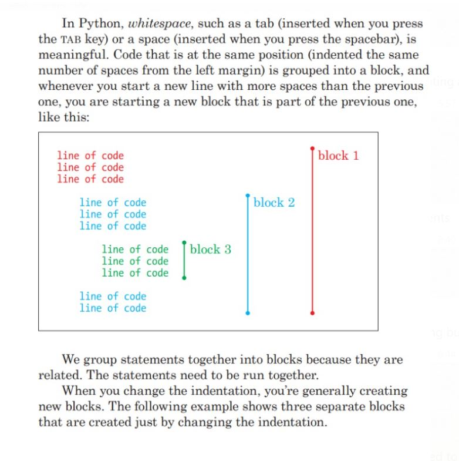
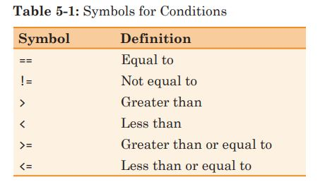

# Class 4 Review and Homework 4

Class 4 was mostly a review of homework 4, we covered the following topics:

How to setup PyCharm and run code from console inside PyCharm

We learned how to save Python code into a file and run from command line or IPython

Indentation and code blocks, remember, when using loops or if/else code blocks, before shifting you need a ```:``` character, example:
```python
if my_variable == 'My Name':
    do something
else:
    do something else
```

 \


 We also learned comparison operators, and how ```=``` is assigment vs. ```==``` is comparator operator. 

 
 \

 ---

 Homework 4 - continuation of Homework 3:

 
```python

import turtle
user_pass = {'leo': 'bestcod_12', 'phil':'codwarrior32'}
user_shape = {'leo' : 'triangle', 'phil': 'square'}

# you can check valid users as 

if input_user in user_pass.keys():


```

- Please write code to ask for user name and password and check if the user is in our dictionary, in case successful entry, you can draw any shape, in case of failure you can write: ```  turtle.write("Access denied")```

- You **cannot** use variables that specific to leo and phillip, it has to be generic, without use of ``` if leo_name == user_pass[input_name]```

- Using ```user_shape``` dictionary, once successfully authenticated, draw shape specified in the dictionary per each user

- Put a loop around the system so on every iteration you clear screen and redraw text and a shape


*Hint: to lookup value in dictionary use:* ```if input_password == user_pass[input_user_name_variable]:```
