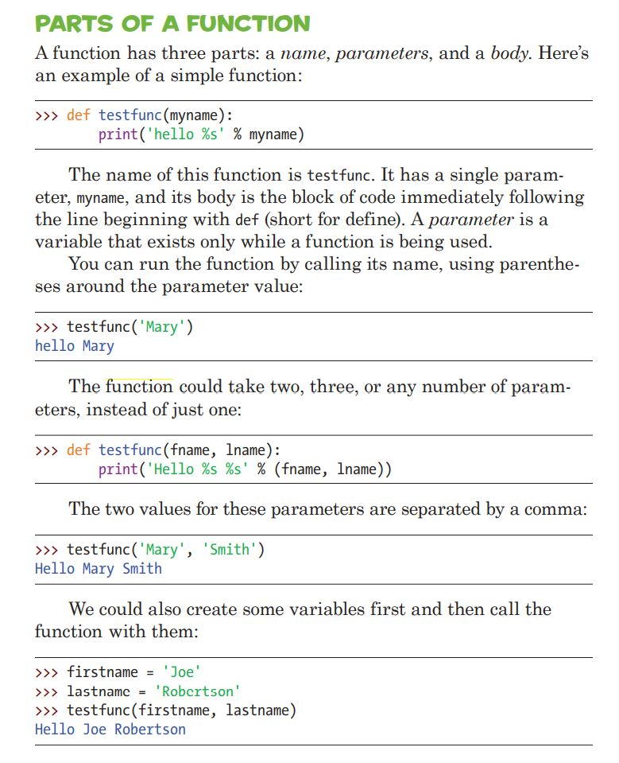

# Class 5 Review and Homework 5

Class 5 was a review session of Homework 4 and introduction of ```functions```

The key review item was use of ```if`` statements and also dictionaries:

```python
user_pass = {'leo': 'bestcod_12', 'phil':'codwarrior32'}
user_shape = {'leo' : 'triangle', 'phil': 'square'}
```

Assume our username is 'leo', kne can ask for a password like below:

```python
input_user = 'leo'
input_password = turtle.textinput('Enter Your Password','Input Password')

# check for password
if input_password == user_pass[input_user]:
    turtle.shape(user_shape[input_user])
else: # if we didn't match
    turtle.write("Access denied")
```
Above concise piece of code will use an associative property of a dictionary to use ```user_pass[input_user]``` to lookup Leo's password. Once it looks it up, it will compare to the password inputted in our text input box. 

Alternative way to do this check is the following:

```python
input_user = 'leo'
input_password = turtle.textinput('Enter Your Password','Input Password')

if input_user == 'leo':
    if input_password == 'bestcod_12':
        turtle.shape('triangle')
elif input_user == 'phil':
    if input_password == 'codwarrior32':
        turtle.shape('square')
else: # if we didn't match
    turtle.write("Access denied")
```


---

# Functions 

Functions are chunks of code that tell Python to do something. They are one way to reuse code—you can use functions in your programs again and again. We also can use modules full functions. 

## Remember: ```turtle``` is a module full of functions

 \


 Examples of functions used in class:
 ```python
 def our_shapes(name):

    user_shape = {'leo': 'triangle', 'phil': 'square'}
    turtle.shape(user_shape[name])

```

--- 
# Homework 5

1. Create 3 separate functions to draw triangle, square and hexagon. You **CANNOT** use ```turtle.shape``` function, please draw using ```turtle.forward``` per our earlier homeworks. 

2. Create code to ask for user input and draw shapes using functions from #1. 

Extra credit:

Using template below, start moving the shape around but replace ```turtle.shape``` with your code for shape:

```python
import turtle
screen = turtle.Screen()
turtle.shape('square') #### REPLACE ME
def left():
    turtle.penup()
    turtle.backward(100)
    turtle.pendown()
    
screen.onkey(left, "Left")
screen.listen()
screen.mainloop()

```                                   
